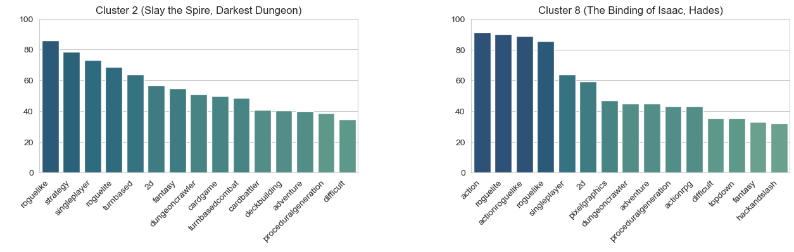

# RPG Analysis
Using a webscraper for a popular PC game storefront (Steam), collected data of 10,000+ RPG games. The collected attributes includes:
- name,
- tags,
- number of reviews and positive reviews,
- release date
- url (mostly for debugging).

Here, tags are descriptive keywords assigned to each game by developers, Steam moderators, and most importantly users. Tags contains more information about a game than broad genres and since these are user-defined, it provides a more user-oriented way of classifying games beyond already existing genres. Thus, by analysing tags, we aim to investigate into possible sub-genres of RPG games.

## Methodology
The analysis breaks down into the following steps:
- preprocessing - for successful tag-based analysis, we focus on games with enough user data (measured by number of reviews) and tags. 
- PCA - of course, there are redundancies in tags (for example, Action and Action RPG) and to remove this, we perform PCA on vectorized the tag lists. MCA would have been a more orthodox option as the tags are categorical variables, however for some reason PCA on centerred data returned better results.
- K-Means - to see if there is any obvious clustering, we then perform K-Means on PCA scores.

## Clustering
After looking at both inertia and sihouette score, we chose 14 as the number of clusters.

These clusters presents a finer classification of the RPG games (Action RPG, Adventure RPG, Casual, JRPG, Party-based RPG, Roguelike, Strategy RPG). For example, by looking at clusters with "action" tags, we obtain a finer classification of Action RPG games into following sub-categories: Cluster 4 (Action, Adventure, Fantasy), Cluster 8 (Action, Roguelike), Cluster 9 (Action, Platformer, Metrovania), and Cluster 10 (Action, Adventure, Sci-Fi). Here, each bar shows the percentage of 15 most common tags for each cluster with a representative game in the title.

Especially since tags provide more information than information contained in the RPG subgenres listed above, we obtain clusters that are more than just combination of the subgenres. Cluster 4 and Cluster 10 are best examples of this. Even if these two clusters contain games with "action" tag and "adventure" tag, Cluster 4 contains fantasy themed games (for example, The Witcher or Hogwarts Legacy) whereas Cluster 10 contains sci-fi themed FPS games (for example, Prey or S.T.A.L.K.E.R series) as seen above.

Similarly, there are two clutsers for roguelike RPG games of different nature. It can be checked in the following plots that Cluster 2 consists of Roguelike-Strategy games such as Slay the Spire or Darkest Dungeon whereas Cluster 8 consists of Action-Roguelike games such as Binding of Issac and Hades.

Plots for all 14 clusters can be found in the [Jupyter notebook](RPG_Clustering_and_Analysis.ipynb) or in [images](images).

## Trend Analysis
The guess is that each clusters follows different pulicaton trends. The prime example of this is shown in the following plots which tracks the number of pulication from each quarter from past decade. Although both clusters exhibit increase in the number of publication per quarter, it is evident that Cluster . In the following plot, we can observe that the increase  

The difference becomes more evident when we compare their yearly publication from past two decades:

Again, plots for all 14 clusters can be found in the [Jupyter notebook](RPG_Clustering_and_Analysis.ipynb) or in [images](images).
