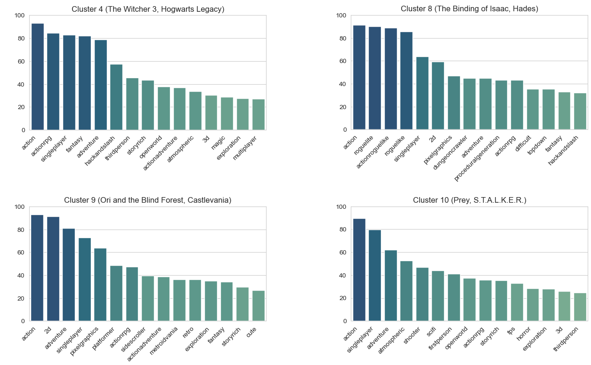

# RPG Analysis
Using a webscraper for a popular PC game storefront (Steam), we collected data of 10,000+ RPG games. The collected attributes include:
- name,
- tags,
- number of reviews and positive reviews,
- release date,
- url (mostly for debugging).

Here, tags are descriptive keywords assigned to each game by developers, Steam moderators, and most importantly users. Tags usually contains more information about a game than the genres self-ascribed by game developers. Also, being user-defined, tags provide a more user-oriented description of games. The goal of this project is to acheive a finer, more user-oriented classification of RPG games on Steam using the tags.

## Methodology
The analysis breaks down into the following steps.
- Preprocessing - For successful tag-based analysis, we focus on games with enough user data (measured by number of reviews) and tags. 
- PCA - To remove redundancies in tags (for example, Action and Action RPG), we perform PCA on the vectorized tag lists after centering (but not scaling). This yielded better classification results than the more conventional MCA on categorical variables.
- K-Means - To see if there is any obvious clustering, we then perform K-Means on the transformed vectors.

## Clustering
After looking at both inertia and silhouette score, we chose 14 as the number of clusters.

Currently, there are seven subgenres of RPG games presented on the online storefront: Action RPG, Adventure RPG, Casual, JRPG, Party-based RPG, Roguelike, Strategy RPG. The returned clusters present a subset of meaningful genre-combinations, thus creating a useful collection of subgenres. As an example, Cluster 2 and Cluster 8 samples Roguelike games of different flavors. It can be checked in the following graphs that Cluster 2 consists of Roguelike-Strategy games such as Slay the Spire or Darkest Dungeon whereas Cluster 8 consists of Action-Roguelike games such as Binding of Issac and Hades.

Going further, by looking at clusters with a high percentage of games with the Action tag, we obtain sub-categories of Action RPG games, as shown in the graph below: Cluster 4, Cluster 8, Cluster 9, and Cluster 10. Each bar in this graph shows the percentage of the games in the cluster that contains each of the 15 most common tags. In addition, we have put in parentheses the names of representative games (chosen by their silhouette score and number of reivews) in each cluster.

Since tags provide information beyond the given genres, we obtain clusters that are more refined than subgenres. For example, Cluster 4 and Cluster 10 both exhibits games that would fall under the subgenre of Action-Adventure RPG. However, Cluster 4 contains fantasy themed games (for example, The Witcher or Hogwarts Legacy) whereas Cluster 10 contains sci-fi themed FPS games (for example, Prey or S.T.A.L.K.E.R series) as seen above.

Such analysis applies equally well to other genres. Plots for all 14 clusters can be found in the [Jupyter notebook](RPG_Clustering_and_Analysis.ipynb) or in [images](images).

## Trend Analysis
Of course, each cluster follows different pulicaton trends. The prime example of this is shown in the following plots which track the number of pulications per quarter from the past decade. Although plots for Cluster 2 and Cluster 8 both indicate an increase in the number of publication per quarter during the past decade, our analysis showcases an explosive growth of Cluster 8 during the period 2020-2022.

The difference in their publication trends can be observed in the following plots, which show the number of publications per year from the past two decades.

Again, plots for all 14 clusters can be found in the [Jupyter notebook](RPG_Clustering_and_Analysis.ipynb) or in [images](images).
